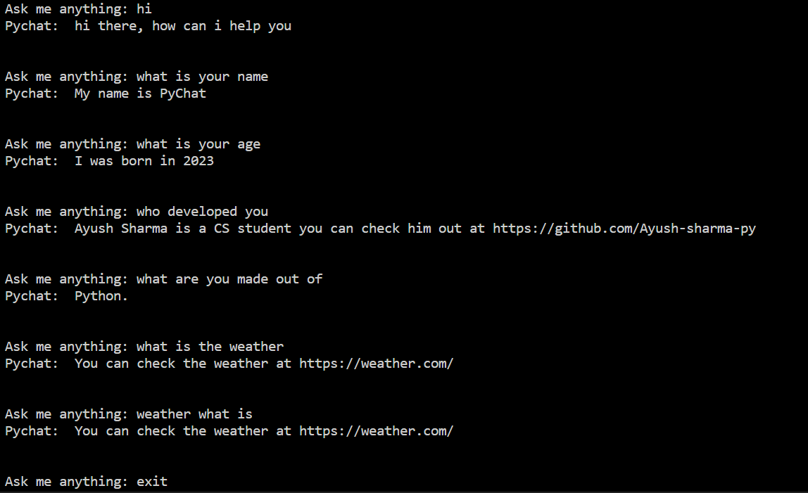

# PyChat

The PyChat chatbot, powered by TensorFlow and NLP, is an intelligent conversational agent. Utilizing natural language processing techniques, it understands user input, performs tokenization and lemmatization, and classifies intents. The trained neural network offers accurate responses, making it an effective and versatile chatbot for various uses.

Edit the `intents.json` file to customize the model

## Files Included

1. **intents.json**: This file contains the training data for the chatbot in JSON format. It includes different "intents" with associated patterns and tags.
2. **model.py**: The Python script used to preprocess the data, build and train the chatbot model, and save the trained model to a file.
3. **words.pkl**: A binary file that stores the preprocessed unique words from the training data.
4. **classes.pkl**: A binary file that stores the list of unique tags from the training data.
5. **chatbot_model.h5**: The trained model file in HDF5 format.
4. **PyChat.py**: The file that will run the chatbot

## Python Libraries Required

Before running the script, make sure to have the following libraries installed:

- **numpy**: For numerical operations on arrays.
- **nltk**: The Natural Language Toolkit library for text processing tasks like tokenization and lemmatization.
- **tensorflow**: The deep learning framework for building and training the neural network.

You can install these libraries using the following pip commands:

```
pip install numpy
pip install nltk
pip install tensorflow
```

## Script Overview

1. The script starts by importing necessary libraries and packages, as well as downloading required NLTK resources 

2. The `intents.json` file is loaded, containing the training data in the form of intent patterns and their corresponding tags.

3. The script preprocesses the data to create a word lemmatized bag of words and a list of unique labels (tags) from the training data.

4. The script saves the word bag and the list of labels to binary files `words.pkl` and `classes.pkl`, respectively, using the `pickle` module.

5. The training data is converted into a format suitable for feeding into the neural network. Each pattern is transformed into a binary array, where each element corresponds to whether a specific word from the word bag is present or not in that pattern. The output is encoded as a one-hot vector indicating the class (tag) of the pattern.

6. The neural network is built using the `tf.keras.Sequential()` API. It consists of three dense layers with ReLU activation and dropout layers for regularization.

7. The optimizer used for training is Stochastic Gradient Descent (SGD) with Nesterov momentum.

8. The model is compiled with categorical cross-entropy loss and accuracy metrics.

9. The model is trained using the training data with a total of 200 epochs and a batch size of 5.

10. The trained model is saved to a file named `chatbot_model.h5`, and the training history is saved to the variable `temp`.

## Running the Script

### To train the chatbot model, follow these steps:

1. Place the `intents.json` file in the same directory as the `train_chatbot.py` script.

2. Install the required libraries as mentioned above if you haven't already.

3. Run the `model.py` script.

```
python model.py
```

4. The training process will start, and you will see the progress and accuracy for each epoch.

5. After training is complete, the script will save the trained model to `chatbot_model.h5`.

6. You can now use the trained model in your chatbot application for natural language understanding and intent classification or you can use the `PyChat.py` script to run the newly trained model.

Note: The effectiveness of the trained model depends on the quality and quantity of the training data in `intents.json`. Make sure to provide diverse and relevant patterns to improve the chatbot's performance.

### To use the default model

1. Clone the repository and run the `PyChat.py` script. It will ask you for a input and give output on the basis of that

2. There is no need to edit anything to use the default model

## Disclaimer

- This script is designed for educational purposes and serves as a basic example of how to train a chatbot using TensorFlow. For production-level chatbots, you may need to implement more advanced techniques and use larger and more diverse datasets. Additionally, the script does not cover other aspects of chatbot development, such as response generation and context tracking.

- The default model is trained to answer questions about itself.


## Screenshot of the working chatbot



## License
This project is under the 